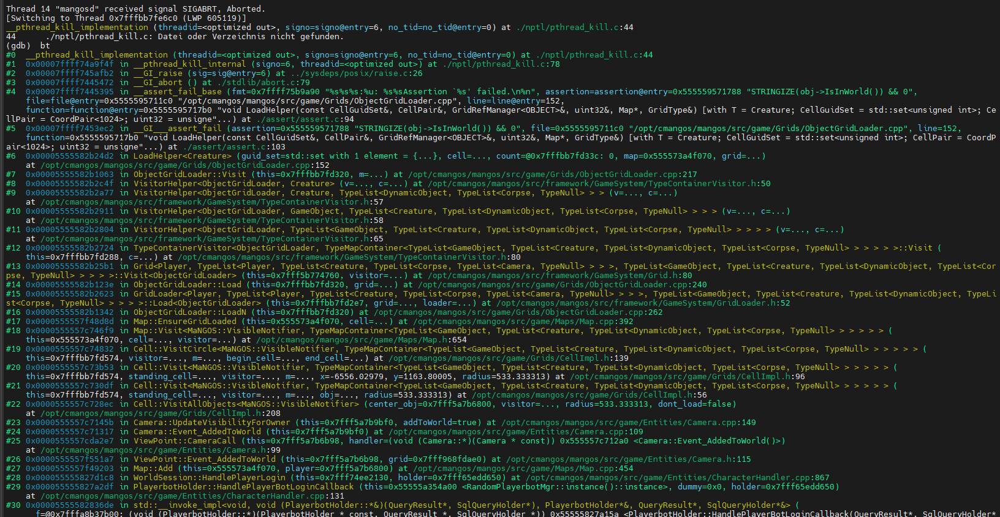
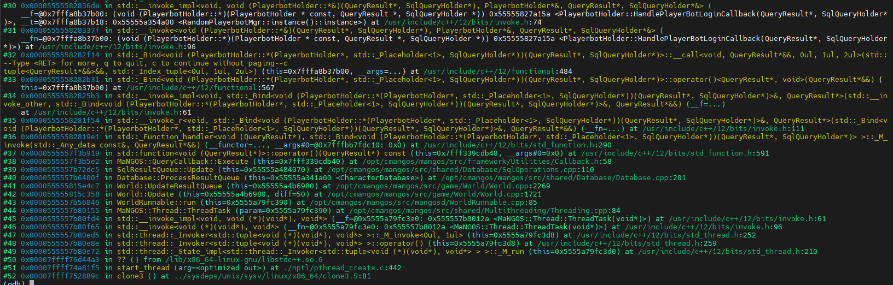

# cmangos-crash-debug

Collection of patch files to prevent known crashes and memory errors in the CMaNGOS core.

## 🛠️ Included Patches

| Patch File | Description |
|------------|-------------|
| [0001-fix-ObjectGridLoader-LoadHelper-crash.patch](0001-fix-ObjectGridLoader-LoadHelper-crash.patch) | Fixes a potential crash in `LoadHelper` caused by `IsInWorld()` assertion failure |

### ❗ Crash Example

This patch addresses the following crash:
  


## 💡 Usage

```bash
cd /opt/cmangos/mangos
git apply /opt/cmangos/mangos/patches/0001-fix-ObjectGridLoader-LoadHelper-crash.patch
